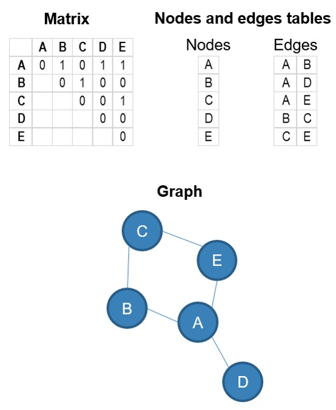
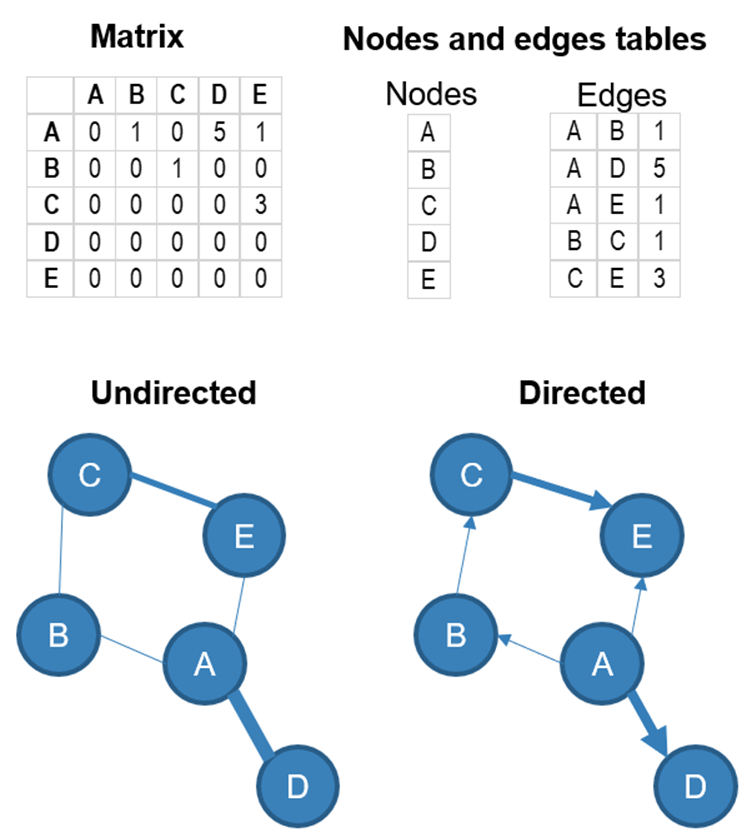
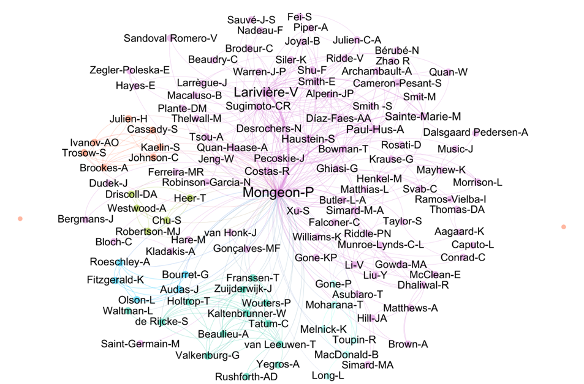
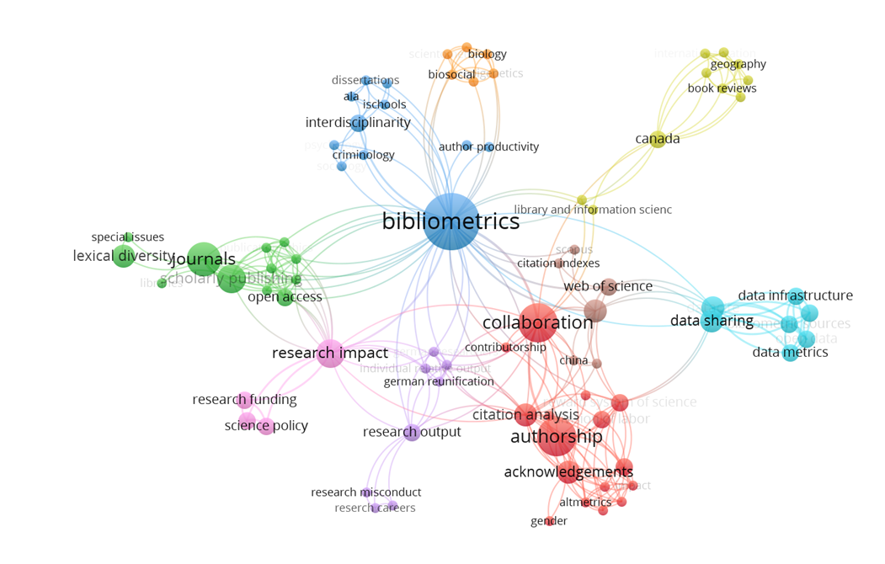
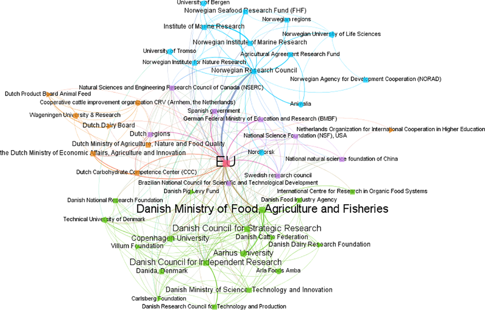

# Visualizing research networks

*With guest author: Madelaine Hare*

## Introduction

This chapter will provide foundations useful for critically creating and interpreting research networks. It also combines practical elements, including software, tools, and resources, so you can build your own network!

## What is a network?

**Networks** can be defined as a set of elements (or entities) that have a relationship to one another. They can provide big-picture analyses of scientific communication by visualizing relationships between sets of research items (e.g., journal articles, journals, books) (Ninkov et al., 2024). Networks help us understand knowledge flows, collaboration patterns, and topical developments and trends in or across fields. Network analysis, or “science mapping”, is approximately 60 years old. The term “Scientography” (think cartography) is also used, but is not as common (Garfield, 1994).

::: callout-tip
## Fun fact

One of the first visualization studies in Scientometrics was produced manually in the 1960s by Garfield (1964), who created a [historical map](https://garfield.library.upenn.edu/papers/finaloverlay.pdf) of DNA research.  Garfield used Isaac Asimov’s book The Genetic Code as a model. Asimov, a professor of biochemistry (better known as the prolific science fiction writer), identified 40 key scientific events in the development of DNA science from the time of Gregor Mendel until the 1961 Nobel work of Marshall Nirenberg at the National Institutes of Health (NIH). They used about 60 published papers mentioned by Asimov to create a mini citation index from \~1000 references they cited (Garfield, 1964).
:::

Derek De Solla Price (1965) made leaps in this area through his work on networks of scientific papers, and the later development of mathematical techniques (Noyons et al., 1999; Noyons & Van Raan, 1998) led to bibliometric mapping (Börner et al., 2003).

## Components of a network

Networks can be represented by matrices, lists of nodes and edges, or graphs. In Figure 1, the same network containing elements A, B, C, D, and E (the nodes) with links (edges) between some of them, is represented in a matrix, a list of nodes and a list of edges, and displayed in a graph.

{#figure1 fig-align="center"}

Networks can be **directed** (there is a direction in the relationship from one node to another) or **undirected** (no direction in the relationship). The relationships can also have a strength (represented by a numerical value in the example below). The weight of the relationship is often represented by the thickness of the link between the nodes, and the direction (if there is one) with an arrow. Here is a directed and undirected version of the same network, with weighted edges.

{width="511"}

### Nodes

The **nodes** of the network represent the entities: the things that are connected to one another in the network. In Figure 1 and Figure 2, the nodes were labelled A, B, C, D, and E. What could these letters represent in a bibliometric network? Essentially, the nodes can represent scholarly works (i.e., every node represents a single work) or any entity that can be identified in the bibliographic record of the works (e.g., authors, departments, institutions, countries, journals, research areas, keywords, funding organization, grant number, etc.) or that extracted from elements of the bibliographic records (e.g., words or terms extracted from the titles and/or abstracts).

A nodes file contains information about the nodes, which can be helpful for either colouring or sizing the nodes in the network visualization. The nodes file will typically contain two columns (the id of the node and the label), but you can include as many additional columns as you wish. 

-   **id**: This is the unique identifier of the node. The **source** and **target** column of your edge files (see below) should contain the ids of the entities.
-   **label**: This is the label of the node, which can be visualized in the network.  
-   **Any categorical variable(s)**: can be used to assign a colour to the nodes or their labels.  
-   **Any numerical variable(s)**: can be used to assign a size or a colour to the nodes or their labels. 

#### Typical nodes in bibliometric networks:

-   Articles
-   Authors
-   Departments
-   Institutions
-   Countries
-   Journals
-   Research areas (topic, specialty, discipline, etc.)
-   Terms (keywords, words from the title or the abstract.
-   Funding organizations
-   Etc.

### Edges

The edges of the network (the lines connecting the nodes to one another)

While this may vary depending on the software that you will use for visualizing your network. You will minimally require an edge file (a.k.a. network file), which is basically a spreadsheet containing the relationships between the nodes. This file should contain the following columns: 

-   **Source** (required): id of the node  
-   **Target** (required): id of the second node 
-   **Weight** (optional): numerical value representing the strength of the relationship 
-   **Type** (optional): directed or undirected

::: callout-important
## Important note

Creating an edge file yourself can be tricky, especially if you are using Excel. Luckily, it is not always necessary since software like VOSviewer, a popular tool for visualization bibliometric networks, will do it for you if you are using data exported from databases like Scopus, Web of Science, Dimensions, or OpenAlex.
:::

## Bibliometric networks

Most networks that we typically encounter in the bibliometrics literature and research assessments fall are **co-occurrence networks**. They are **undirected** networks (i.e., there is no direction to the relationship). In this type of network, there is a relationship between two entities when they are co-occurring in the same research output (typically a research article). Below are a few examples.

### Co-authorship networks

A co-authorship network is typically used to analyze scientific collaboration patterns among authors, institutions, or countries (multiple researchers/institutions/countries authoring a paper together). Here, as an example, is my co-authorship network as of 2023.

Another example: Silva, F.S.V., Schulz, P.A. & Noyons, E.C.M. Co-authorship networks and research impact in large research facilities: benchmarking internal reports and bibliometric databases. Scientometrics 118, 93–108 (2019). <https://doi.org/10.1007/s11192-018-2967-4>  

### Keyword or term co-occurrence networks

Another important type of co-occurrence network involves keywords or terms that appear together in the same document. Keyword co-occurrence involves keywords (e.g., author keywords, index terms) appearing in the same work, while term co-occurrence uses text mining to extract terms from the text data (titles or abstracts). Here, as an example, is the keyword co-occurence network based on my publications up to 2023.

And here is a network of funders who co–funded research in food research in Denmark, The Netherlands, and Norway [@aagaard2020].

Another example: Narong, D. K., & Hallinger, P. (2023). A Keyword Co-Occurrence Analysis of Research on Service Learning: Conceptual Foci and Emerging Research Trends. Education Sciences, 13(4), 339. <https://doi.org/10.3390/educsci13040339> 

### Bibliographic coupling

In a bibliographic coupling network, there is an undirected relationship between paper A and paper B if they both cite paper C. The strength of the relationship between A and B is determined by the number of references that they have in common.

### Co-citations

In a co-citation network, there is an undirected relationship between paper A and paper B if they are both cited by paper C. The strength of the relationship between A and B is determined by the number of papers that cite both A and B together.

Phan Tan, L. (2022). Bibliometrics of social entrepreneurship research: Cocitation and bibliographic coupling analyses. Cogent Business & Management, 9(1). <https://doi.org/10.1080/23311975.2022.2124594>  

### Direct citations

Direct citation networks are the main type of **directed** network in bibliometrics. In these networks, the edges represent a reference made to one node by another (a citation received by a node from another). For example, if paper A cites paper B, the network will contain an arrow pointing from A to B.

## Drawing insights from a network

Some things to look for when interpreting research networks, depending on your network type.

-   **Influential actors or hubs**: These will be highly connected to authors, journals, or institutions.
-   Collaboration patterns can help you characterize a local, national, or international network of research.
-   Co-citation or keyword networks may reveal emerging or declining research topics/themes.
-   **Structural and systemic insights**: Consider how your network might reveal inequities, silos, or power dynamics in knowledge production.

## Software and tools

### VOSviewer

[VOSviewer](https://www.vosviewer.com/) was developed by Nees Jan van Eck and Ludo Waltman of CTWS Leiden. It is a software tool for constructing and visualizing bibliometric networks (journals, researchers, or individual publications), constructed based on citation, bibliographic coupling, co-citation, or co-authorship relations. VOSviewer also offers text mining functionality that can be used to construct and visualize co-occurrence networks of important terms extracted from a body of scientific literature. This is the primary software we use in this course, and it can be downloaded from the website linked above. 

Data sources supported by VOSviewer include OpenAlex, Crossref, Dimensions, Scopus, Web of Science, PubMed, Wikidata, and more. VOSviewer allows you to query some of these sources (OpenAlex, Europe PMC, SemanticScholar, Wikidata, Crossref, and OpenCitation) directly through an API. To use other sources, you will need to download the data and import it into VOSviewer. 

::: callout-tip
## Fun fact

Fun fact: The VOS is VOSviewer stands for “visualization of similarities”. This is because the distance between entities in a network (e.g., researchers, publications) is defined by their strength.
:::

### Gephi

[Gephi](https://gephi.org/) was originally developed by students at the University of Technology of Compiegne in France. Now, the Gephi team gathers every year to maintain its codebase, meet users, and discuss and design new features. Gephi was built for exploratory data analysis, to help analysts explore networks, test hypotheses, and discover meaningful patterns in relational data. 

### Sci2 Tool

The [Science of Science (Sci2) Tool](https://sci2.cns.iu.edu/user/index.php) is a modular toolset specifically designed for the study of science. It supports the temporal, geospatial, topical, and network analysis and visualization of scholarly datasets at the micro (individual), meso (local), and macro (global) levels.

### NetworkX

[NetworkX](https://pypi.org/project/networkx/) is a Python package for the creation, manipulation, and study of the structure, dynamics, and functions of complex networks.

### igraph

[R/igraph](https://r.igraph.org/) is an R package of the igraph network analysis library. 

### **Citespace**

[CiteSpace](https://citespace.podia.com/) is a visual analytics tool for analyzing trends and patterns in the scholarly literature of a field of research.

::: callout-tip
## Science or Art?

Note that aesthetics can impact interpretability of networks. Consider attributes like colour, size of nodes and labels, and edge thickness for clarity. Creating a network is both a science **and** an art!

Graphics editors like [Inkscape](https://inkscape.org/release/inkscape-1.4.2/windows/64-bit/msi/dl/) (free and open source) can help you with editing networks. Take it away, van Gogh!
:::

## Future directions

What is the future of research networks? Well, scholars are integrating altmetric data more and more to capture the growing data on social media interactions, as well as data on open science, such as preprints, to offer a more holistic view of science. 

While networks offer static snapshots of the research ecosystem, dynamic and interactive visualizations can help with exploring the temporal evolution of relationships, dynamics, and fields through time-scaled networks. [Multidimensional](https://www.digital-science.com/blog/2023/09/a-multi-dimensional-approach-to-assessing-the-impact-of-the-uns-sustainable-development-goals-sdgs/) maps are also being produced as combinations of different relationships (authorship, citations, topics) into single visualizations.

## References
